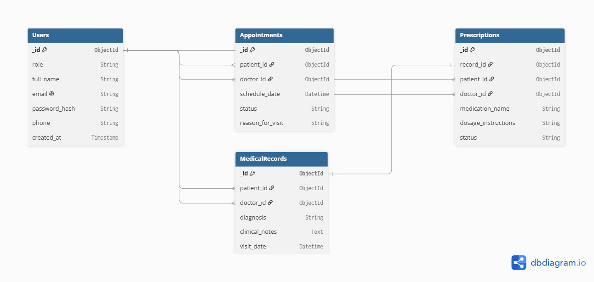

# VitalSync — Enterprise EHR & Clinical Operations Platform

> Commercial-Grade Electronic Health Record (EHR) and Clinical Management Solution.

**Track Declaration:** Track B (Fullstack Developer) - MERN Stack Focus

## 1. Executive Summary & Vision

**VitalSync** is an enterprise-grade Electronic Health Record (EHR) and hospital management interface designed to modernize clinical workflows. The platform bridges the gap between patient engagement and medical administration by providing unified, role-based access to medical histories, appointment scheduling, and digital prescriptions.

**Project Vision:** To architect a highly scalable, secure, and intuitive digital healthcare ecosystem that minimizes administrative friction and maximizes clinical efficiency.

### Target Performance KPIs

- **Lighthouse Performance Score:** 100/100 across Performance, Accessibility, Best Practices, and SEO.
- **Mobile-First Responsiveness:** Pixel-perfect fluid layouts across mobile (320px+), tablet, and desktop viewports.
- **State Management:** Zero unnecessary UI re-renders during complex state mutations (e.g., appointment booking, calendar grid updates).
- **Security & Reliability:** Strict Role-Based Access Control (RBAC) ensuring decoupled state access and route protection for Patients, Doctors, and Admins.

## 2. Role-Based Access Control (RBAC) & User Personas Matrix

VitalSync relies on strict role isolation. The UI and data access layers are completely decoupled based on the authenticated user's assigned role.

### User Personas

1. **The Patient:** Seeking medical care. Needs low-friction access to book appointments, view their personal medical history timelines, and download digital prescriptions.
2. **The Doctor:** Providing clinical care. Needs high-efficiency dashboards to view their daily appointment queue, author clinical notes, and generate prescriptions.
3. **The Administrator:** Managing hospital operations. Needs oversight of all staff, department scheduling, and platform audit logs.

### Access Control Matrix

| Feature Module                 |     Patient      |      Doctor      | Administrator |
| :----------------------------- | :--------------: | :--------------: | :-----------: |
| **Personal Health Timeline**   |   ✅ View Own    | ✅ View Assigned | ❌ Restricted |
| **Appointment Booking**        | ✅ Create/Cancel |  ❌ Restricted   | ✅ Manage All |
| **Doctor Availability Grid**   |   ✅ View Only   |  ✅ Manage Own   | ✅ Manage All |
| **Clinical Notes & Diagnoses** |  ❌ Restricted   |  ✅ Create/Edit  | ❌ Restricted |
| **Digital Prescriptions**      | ✅ Download Own  | ✅ Generate/Sign | ❌ Restricted |
| **Staff & Role Management**    |  ❌ Restricted   |  ❌ Restricted   | ✅ Full CRUD  |

## 3. Tech Stack & Engineering Architecture

VitalSync is architected using a modern, decoupled web architecture designed for modularity, rapid UI performance, and zero-downtime scalability.

### Core Technology Stack

- **Frontend Framework:** Next.js (React 18+, App Router)
- **Styling Architecture:** Tailwind CSS with CSS Variables for dynamic Dark/Light theme toggles
- **Component Primitives:** Shadcn UI / Radix UI headless primitives
- **Iconography:** Lucide React (Clean, accessible SVG icon system)
- **State Management:** Zustand / React Context API (Decoupled store for RBAC state and calendar grid updates)
- **Data Validation:** Zod (Type-safe schema validation for form inputs and API payloads)
- **Backend Runtime:** Node.js & Express.js (RESTful API architecture)
- **Database & Persistence:** MongoDB Atlas with Mongoose ORM
- **Deployment Strategy:** Vercel (Frontend Client) & Render (Backend REST API)

### Architecture Principles

1. **Component Modularization:** Clean separation of concerns with atomic design (`components/ui`, `components/dashboard`, `components/forms`).
2. **Type Safety & Sanitization:** Strict payload validation using Zod before issuing API network calls.
3. **Optimized Render Cycles:** Memoized client state and lazy-loaded route views to achieve 100 Lighthouse performance metrics.

## 4. Database Schema & Entity Relationship Diagram (ERD)

The VitalSync database architecture utilizes MongoDB. While NoSQL is document-based, we maintain strict relational integrity between patients, doctors, and their associated clinical data using object references.

### Core Collections

1. **Users:** Stores authentication credentials, profiles, and RBAC roles (Patient, Doctor, Admin).
2. **Appointments:** Manages the scheduling grid, linking a Patient to a Doctor with status workflows (Scheduled, Completed, Cancelled).
3. **MedicalRecords:** The chronological clinical history containing diagnoses and physician notes.
4. **Prescriptions:** Digital medication orders linked to specific medical records and patients.

### Schema Definition (DBML)

```dbml
Table Users {
  _id ObjectId [pk]
  role String [note: 'patient, doctor, admin']
  full_name String
  email String [unique]
  password_hash String
  phone String
  created_at Timestamp
}

Table Appointments {
  _id ObjectId [pk]
  patient_id ObjectId [ref: > Users._id]
  doctor_id ObjectId [ref: > Users._id]
  schedule_date Datetime
  status String [note: 'scheduled, completed, cancelled']
  reason_for_visit String
}

Table MedicalRecords {
  _id ObjectId [pk]
  patient_id ObjectId [ref: > Users._id]
  doctor_id ObjectId [ref: > Users._id]
  diagnosis String
  clinical_notes Text
  visit_date Datetime
}

Table Prescriptions {
  _id ObjectId [pk]
  record_id ObjectId [ref: - MedicalRecords._id]
  patient_id ObjectId [ref: > Users._id]
  doctor_id ObjectId [ref: > Users._id]
  medication_name String
  dosage_instructions String
  status String [note: 'active, dispensed']
}
```

### Entity-Relationship Diagram (ERD)



## 5. API Endpoint Contracts & Global Client State Tree

### RESTful API Endpoint Specifications

#### Authentication & User Management

- `POST /api/v1/auth/register` — Register a new user (`Patient` or `Doctor`)
- `POST /api/v1/auth/login` — Authenticate credentials and return JWT token
- `GET /api/v1/auth/me` — Retrieve currently authenticated user profile

#### Appointments Engine

- `GET /api/v1/appointments` — Fetch list of appointments (filtered by `patient_id` or `doctor_id`)
- `POST /api/v1/appointments` — Create a new appointment booking
- `PATCH /api/v1/appointments/:id/status` — Update appointment status (`scheduled`, `completed`, `cancelled`)

#### EHR Medical Records & Prescriptions

- `GET /api/v1/medical-records/patient/:patientId` — Retrieve medical history timeline for a patient
- `POST /api/v1/medical-records` — Author new clinical note and diagnosis (`Doctor` only)
- `GET /api/v1/prescriptions/patient/:patientId` — Fetch active digital prescriptions
- `POST /api/v1/prescriptions` — Issue digital prescription linked to a medical record (`Doctor` only)

---

### Global Client State Tree (Zustand Store)

To avoid excessive prop-drilling and unnecessary re-renders across dashboard views, client state is organized into four isolated slices:

```text
RootStateStore
├── authStore
│   ├── user: { _id, role, full_name, email } | null
│   ├── token: string | null
│   ├── isAuthenticated: boolean
│   ├── login(credentials): Promise<void>
│   └── logout(): void
│
├── appointmentStore
│   ├── appointments: Appointment[]
│   ├── selectedDate: Date
│   ├── filterStatus: 'all' | 'scheduled' | 'completed' | 'cancelled'
│   ├── fetchAppointments(): Promise<void>
│   └── bookAppointment(payload): Promise<void>
│
├── recordStore
│   ├── activePatientHistory: MedicalRecord[]
│   ├── activePrescriptions: Prescription[]
│   ├── fetchPatientEHR(patientId): Promise<void>
│   └── addClinicalEntry(payload): Promise<void>
│
└── themeStore
    ├── theme: 'light' | 'dark' | 'system'
    └── toggleTheme(): void
```

## 6. Sprint Execution Roadmap

To ensure zero technical debt and manageable deliverables, development is divided across four distinct sprints:

- **Sprint 14 (MVP Foundation):** Initialize Next.js frontend and Node.js backend. Establish MongoDB connection, configure NextAuth/JWT authentication, and build basic RBAC routing.
- **Sprint 15 (Core CRUD Completion):** Implement the Appointment Engine (booking/canceling), Doctor Dashboard queue, and Patient Health Timeline.
- **Sprint 16 (Advanced Features & UX Polish):** Integrate the Digital Prescription generator (PDF export capability), wire up global state with Zustand, and finalize Dark/Light mode UI polish.
- **Sprint 17 (CI/CD & Production Go-Live):** Final Lighthouse optimization audits, environment variable configuration, and deployment to Vercel (Frontend) and Render (Backend).

## 7. Visual Asset & UI/UX Strategy

- **Design Tooling:** High-fidelity DOM wireframing via Figma mapping at least 3 core viewports (Auth, Patient Dashboard, Doctor Console).
- **Responsive Guidelines:** All interfaces will adopt a mobile-first Tailwind configuration, ensuring fluid layouts before scaling to tablet/desktop breakpoints.
- **Media & Assets:** Placeholder medical imagery and user avatars will be dynamically sourced from Unsplash using high-quality, professional search queries.
- **Favicon:** The application utilizes a 100% lightweight, scalable inline SVG favicon configured at the document root to eliminate extra network requests.

### UI/UX Wireframes (Figma)

The low-fidelity DOM wireframes for the core viewports (Authentication, Doctor Console, and Patient EHR) have been mapped to ensure strict layout adherence during the frontend development phase.

- **[View VitalSync Figma Wireframes Here](https://www.figma.com/design/S4T77qVAGEKMaCLpilYL2q/Untitled?node-id=0-1&t=SFZ9mZ8bBscwNHNc-1)**
